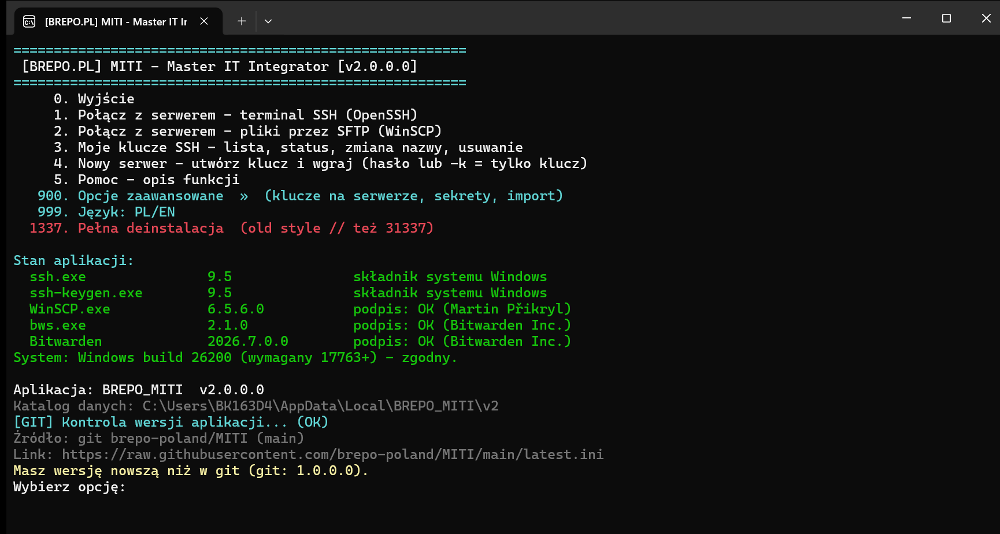
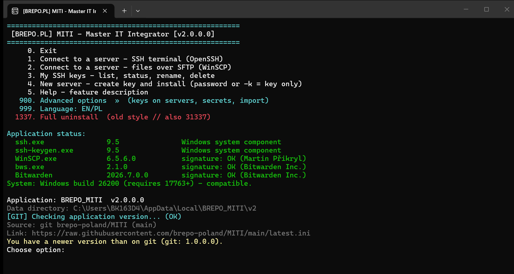

# BREPO_MITI — Master IT Integrator

**[PL]** Menedżer połączeń i kluczy SSH/SFTP dla Windows. Natywna aplikacja C++/Win32 — jeden plik `.exe`, bez instalatora.

**[EN]** An SSH/SFTP connection and key manager for Windows. A native C++/Win32 application — a single `.exe`, no installer.

**PL** — wersja polska poniżej · **EN** — English version below.

**Strona / Website:** <https://miti.brepo.pl>

**Pobierz / Download:** [Releases → `BREPO_MITI.exe`](https://github.com/brepo-poland/MITI/releases/latest)

### 🖥️ Podgląd · Preview

**[PL]** To jest **widok oprogramowania** — ekran główny MITI w oknie konsoli (menu, stan
narzędzi, weryfikacja podpisów i sum SHA-256, kontrola wersji). Po lewej/na górze wersja PL,
poniżej wersja EN.
**[EN]** This is a **view of the software** — the MITI main screen in the console window (menu,
tool status, signature and SHA-256 verification, version check). PL version first, EN below.

> ### 💬 Community & Support · Społeczność i wsparcie
>
> **[PL]** Dołącz do społeczności, pytaj o pomoc, zgłaszaj błędy i pomóż testować:
> - 💬 **[r/miti_app](https://www.reddit.com/r/miti_app/)** — oficjalna społeczność MITI na Reddicie.
> - 🐛 **Błąd?** Otwórz [Issue](https://github.com/brepo-poland/MITI/issues) (szablon „Bug report") albo napisz na r/miti_app.
> - 💡 **Pomysł na funkcję?** Chętnie posłuchamy — Issues lub społeczność.
> - 📧 **Kontakt:** [miti@brepo.pl](mailto:miti@brepo.pl) — napisz do nas bezpośrednio.
> - 🧪 **Testy:** pobierz `BREPO_MITI.exe` z [Releases](https://github.com/brepo-poland/MITI/releases/latest), sprawdź swój codzienny scenariusz SSH/SFTP i zgłoś uwagi. Lista kontrolna: [TESTING.md](TESTING.md). Wymagania: Windows 10 (1809+) 64-bit.
>
> **[EN]** Join the community, ask for help, report bugs, and help test:
> - 💬 **[r/miti_app](https://www.reddit.com/r/miti_app/)** — the official MITI community on Reddit.
> - 🐛 **Found a bug?** Open an [issue](https://github.com/brepo-poland/MITI/issues) (use the "Bug report" template) or post in r/miti_app.
> - 💡 **Feature idea?** We'd love to hear it — Issues or the community.
> - 🧪 **Testing:** download `BREPO_MITI.exe` from [Releases](https://github.com/brepo-poland/MITI/releases/latest), try your everyday SSH/SFTP workflow, and report back. Checklist: [TESTING.md](TESTING.md). Requirements: Windows 10 (1809+) 64-bit.
>
> Dziękujemy! 🙏 · Thanks! 🙏

---

## PL — Polski

**Aplikacja konsolowa** — otwiera się w oknie terminala (to „czarne okno" podobne do wiersza
poleceń). Tak jest **celowo**: sesja SSH (systemowy OpenSSH) płynie w **tym samym oknie**, z prawdziwym
TTY, zamiast wyskakiwać w osobnym.

Loguje się kluczem lub hasłem, generuje i wgrywa klucze Ed25519 na serwer, a klucze
prywatne trzyma zaszyfrowane mechanizmem **DPAPI** — odczyta je tylko Twoje konto
Windows, nic nie leży jawnie na dysku.

### Co potrafi
- **SSH / TTY** — interaktywna sesja terminalowa (silnik: systemowy OpenSSH), prawdziwy TTY w tym samym oknie.
- **WinSCP / SFTP** — graficzne przeglądanie i przesyłanie plików.
- **Nowy serwer** — logowanie hasłem lub samym kluczem: wygenerowanie i wgranie klucza Ed25519, z opcją przejścia na root (sudo/su).
- **Moje klucze** — lista i status artefaktów, zmiana nazwy, usuwanie, wymiana klucza na serwerze oraz test „czy faktycznie loguje" z auto-naprawą.
- **Cztery rodzaje artefaktów** — klucz prywatny SSH (`.dpapi`), hasło użytkownika (`.pdpapi`) oraz token i klucz API (`.bdpapi`), wszystkie opisane standardem **MITI KEY FORMAT V11** (19 pól w stałej kolejności).
- **Dwa magazyny** — lokalny DPAPI oraz opcjonalnie **Bitwarden Secrets Manager**; widok pokazuje, z którego magazynu pochodzi odczyt.
- **Import** — pliki MITI `.dpapi` z backupu lub innego folderu, a także obcy klucz OpenSSH.
- **Podgląd zawartości** — odszyfrowanie artefaktu z obu magazynów, sekret w osobnej linii do skopiowania.
- **Polecenie awaryjne** — jedna linia PowerShella odszyfrowująca wszystko **bez udziału MITI**, gdyby program nie chciał się uruchomić.
- **Narzędzia portable** — pobiera i weryfikuje WinSCP i bws (klient SSH jest składnikiem Windows - nie pobieramy go) (podpis cyfrowy + SHA-256 zapamiętane w DPAPI).
- **Bitwarden SSH Agent** — opcjonalnie logowanie kluczem trzymanym w Bitwardenie.
- **Samoaktualizacja** — sprawdza nowszą wersję i (za zgodą) sama się aktualizuje.

### Wymagania
Windows 10 1809 (build 17763) lub nowszy, 64-bit.

### Pierwsze uruchomienie
Plik `BREPO_MITI.exe` jest **podpisany cyfrowo** (certyfikat EV, Brepo Sp. z o.o.). Jeśli
SmartScreen pokaże „nierozpoznana aplikacja" (nowe wydanie dopiero buduje reputację) —
kliknij **Więcej informacji → Uruchom mimo to**, albo we Właściwościach pliku zaznacz **Odblokuj**.

### Licencja
MIT — pełny tekst w pliku [LICENSE](LICENSE). Pełne informacje PL/EN oraz podziękowania dla
autorów narzędzi: [LICENSE_PL_EN](LICENSE_PL_EN). Narzędzia (WinSCP / bws)
są **pobierane** w czasie działania z oficjalnych źródeł i pozostają na własnych licencjach.

---

## EN — English

**An SSH/SFTP connection and key manager for Windows.** A native C++/Win32 application —
a single `.exe`, no installer.

**A console application** — it opens in a terminal window (the "black window" that looks like
a command prompt). This is **by design**: the SSH session (system OpenSSH) runs in **that same window**
with a real TTY, instead of popping up separately.

It logs in with a key or a password, generates and uploads Ed25519 keys to the server, and
keeps private keys encrypted with **DPAPI** — only your Windows account can read them,
nothing is stored in plaintext.

### Features
- **SSH / TTY** — interactive terminal session (engine: system OpenSSH), a real TTY in the same window.
- **WinSCP / SFTP** — graphical file browsing and transfer.
- **New server** — password login or key-only: generate and install an Ed25519 key, with an optional switch to root (sudo/su).
- **My keys** — list and status of artifacts, rename, delete, rotate a key on the server, and a "does it actually log in" test with auto-repair.
- **Four artifact kinds** — SSH private key (`.dpapi`), user password (`.pdpapi`), plus API token and API key (`.bdpapi`), all described by the **MITI KEY FORMAT V11** standard (19 fields in a fixed order).
- **Two stores** — local DPAPI and optionally **Bitwarden Secrets Manager**; the view shows which store a read came from.
- **Import** — MITI `.dpapi` files from a backup or another folder, and foreign OpenSSH keys.
- **Content viewer** — decrypt an artifact from either store, with the secret on its own line ready to copy.
- **Emergency command** — a single PowerShell line that decrypts everything **without MITI**, should the program refuse to start.
- **Portable tools** — downloads and verifies WinSCP and bws (the SSH client is a Windows component - not downloaded) (digital signature + SHA-256 remembered in DPAPI).
- **Bitwarden SSH Agent** — optionally log in with a key kept in Bitwarden.
- **Self-update** — checks for a newer version and (on approval) updates itself.

### Requirements
Windows 10 1809 (build 17763) or newer, 64-bit.

### First run
`BREPO_MITI.exe` is **digitally signed** (EV certificate, Brepo Sp. z o.o.). If SmartScreen
shows an "unrecognized app" warning (a new release is still building reputation), click
**More info → Run anyway**, or tick **Unblock** in the file's Properties.

### License
MIT — full text in [LICENSE](LICENSE). Full PL/EN information and acknowledgements to the
tool authors: [LICENSE_PL_EN](LICENSE_PL_EN). The tools (WinSCP / bws) are
**downloaded** at runtime from their official sources and remain under their own licenses.

---

## Podziękowania · Acknowledgements

**PL** — Ogromne podziękowania dla autorów poniższych narzędzi — zrobili świetną robotę, a BREPO_MITI jedynie łączy je w wygodną całość dla Windows. Narzędzia są pobierane w czasie działania z oficjalnych źródeł i pozostają na własnych licencjach.

**EN** — Huge thanks to the authors of the tools below — they did great work; BREPO_MITI merely brings them together into one convenient whole for Windows. The tools are downloaded at runtime from their official sources and remain under their own licenses.

| Narzędzie · Tool | Autor · Author | Licencja · License |
|---|---|---|
| [WinSCP](https://winscp.net/) | Martin Prikryl | GNU GPL |
| [Bitwarden Secrets Manager CLI](https://github.com/bitwarden/sdk-sm) | Bitwarden Inc. | GNU GPL / Bitwarden License |

Klient SSH (`ssh.exe`, `ssh-keygen.exe`) jest **składnikiem systemu Windows** — nie pobieramy go
i nie pieczętujemy jego sumy kontrolnej, bo podpisuje go i aktualizuje producent systemu.
· The SSH client is a **Windows system component** — not downloaded, not checksum-sealed.

Pełne informacje o licencjach · full license info: [LICENSE_PL_EN](LICENSE_PL_EN).

---

© 2026 [POLAND] Brepo Sp. z o.o. · Strona / Website: <https://miti.brepo.pl> · <https://brepo.pl>
